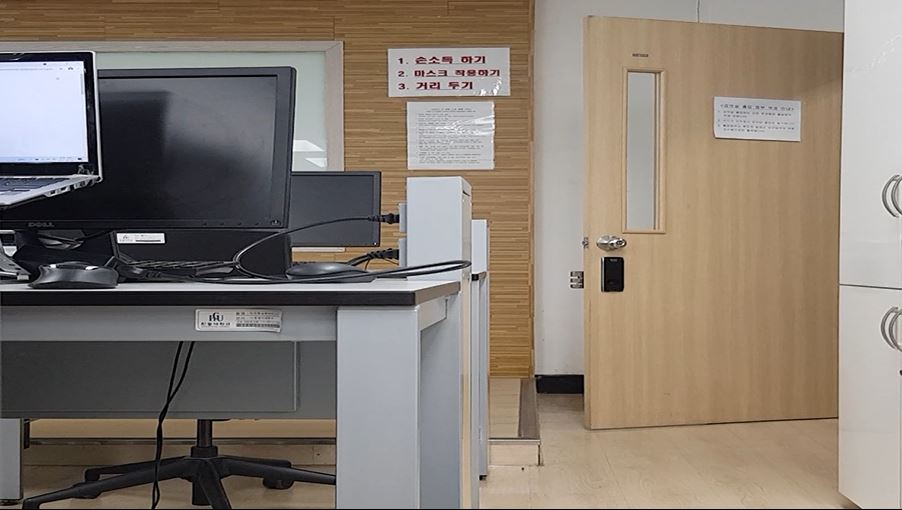
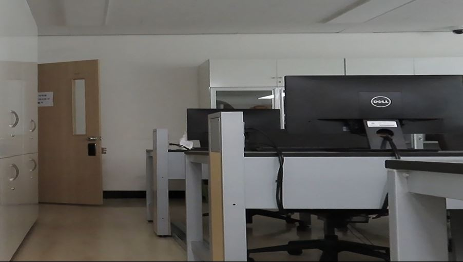
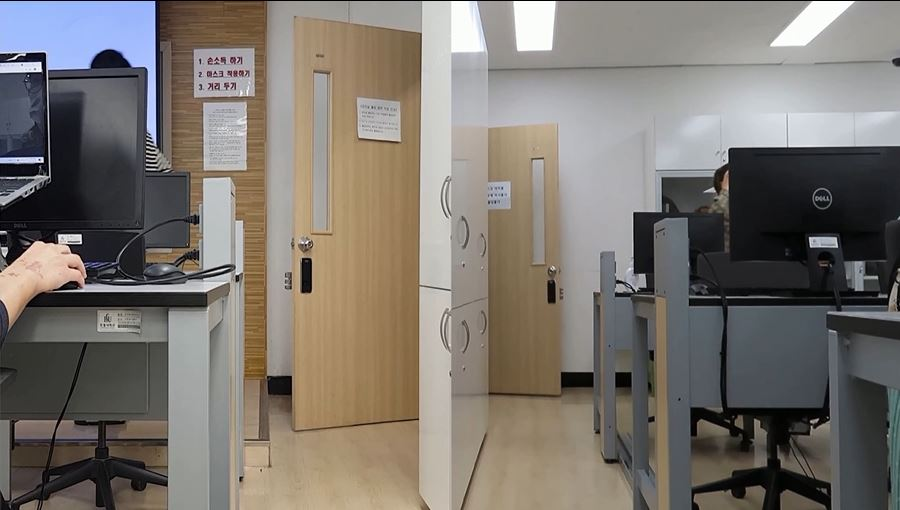
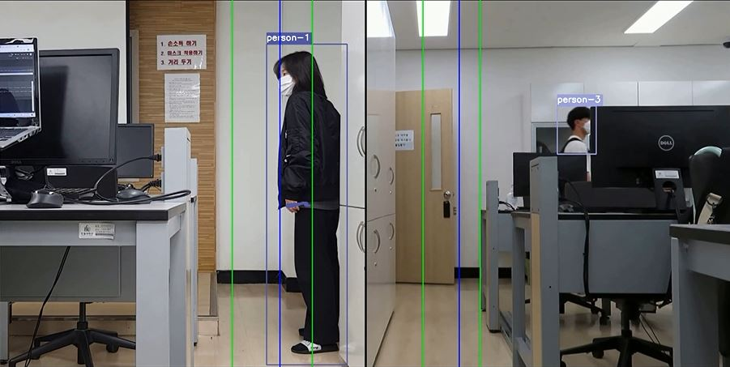
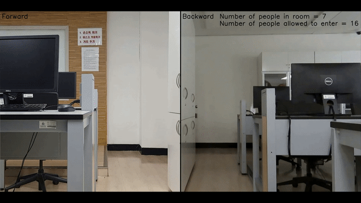

# Tutorial: Human-Access-Control application using deep learning and object tracking algorithms
**Author:** S.-S. Lim & H.-J. Kim<br>
**Date created:** 2021/06/21<br>

## Introduction
Since the outbreak of COVID-19, people have been restricted from entering various places. However, automation of access control is not yet used in most places.
So, this application aims to automatically identify and control people's access to rooms, buildings, or outdoors.
This application can be used for personnel control due to government guidelines, attendance checks in classes, building usage status, etc.<br><br>
The application was created using open source YOLOv4, Deep SORT and TensorFlow.
YOLOv4 is an algorithm that performs object detection using deep convolutional neural networks, and is created by adding additional algorithms to YOLOv3.
YOLOv4 is a 10% improvement in accuracy (AP) over YOLOv3 and has the advantage of fast and accurate object detection in a typical learning environment using only one GPU.
Deep SORT(Simple Online and Realtime Tracking with a Deep Association Metric) is an algorithm for object tracking.
It was created using deep learning, Kalman filter and Hungarian algorithm.<br>

**References:**
  * [YOLOv4 and Deep SORT: https://github.com/theAIGuysCode/yolov4-deepsort](https://github.com/theAIGuysCode/yolov4-deepsort)
  * [Counting the passing objects: https://github.com/emasterclassacademy/Single-Multiple-Custom-Object-Detection-and-Tracking](https://github.com/emasterclassacademy/Single-Multiple-Custom-Object-Detection-and-Tracking)

## Requirements
To get started, you must first download the YOLOv4 and Deep SORT algorithm codes and directories from my GitHub repository. Download all files: https://github.com/LIMSES/Access_Control_Application/<br>

Also, you need at least one GPU to use YOLOv4. CUDA toolkit must be installed for GPU use.
CUDA Toolkit version 10.1 is the proper version for the TensorFlow version used in this application.
https://developer.nvidia.com/cuda-10.1-download-archive-update2<br>

After that, install the proper dependencies either via Anaconda. You can install dependencies through either conda-gpu.yml or requirements-gpu.txt.
### Tensorflow GPU
```bash
# Using conda-gpu.yml
conda env create -f conda-gpu.yml
conda activate yolov4-gpu

# or you can use requirements-gpu.txt
pip install -r requirements-gpu.txt
```
## Training Data
For object detection, the application must first be trained with a large number of data.
However, since the application aims to detect only humans, it use an official pre-trained YOLOv4 model that is able to detect 80 classes without additional training data.
Download pre-trained yolov4.weights file: https://drive.google.com/file/d/1VCRU3SpO5x76KngBr8FHAGR68UqMgbEs/view?usp=sharing <br>

You must download and extract the weights.zip file and place the yolov4.weights file in the data directory of your workspace(./data/yolov4.weights).
If the download doesn't work properly, refer to the [reference](https://github.com/theAIGuysCode/yolov4-deepsort) in this tutorial.<br>

The weight file downloaded is a darknet weight file. Transformation is required to apply file to tensorflow models.
If you run the save_model.py, checkpoints directory is created and tensorflow model is stored.
### Convert darknet weights to tensorflow model
```bash
python save_model.py --model yolov4
```
## Downloading Sample Videos
In a place with one entrance, the application can be operated based on real-time images of that one entrance.
Likewise, in another place with two or more entrances, the application should be operated based on two or more images.
Simultaneous processing can be done through communication, such as ROS systems, but this tutorial combines images for easy processing.<br>

The videos going to use in the tutorial are entrance to the front and back door before the start of DLIP class at Handong Global University.
The videos have speeds of three times faster and was edited when there was no human access to reduce running time.
Also, this project has the consent of class members.
You can download and extract the videos.zip file and place the videos directory in the data directory(./data/videos/frontdoor.mp4).
Download sample videos: https://drive.google.com/file/d/10Cts1ObT_e_8B6jleXzUCb2PsgGcoMiM/view?usp=sharing <br>

### Front door
<p align="center"></p>

### Back door
<p align="center"></p>

## Combining Two Videos
The videos are combined for simultaneous identification.

### Import libraries
```bash
import cv2 
import numpy as np
```
### Get the videos and save the information
FourCC means four character code and a 4-byte string is a unique character that separates the data type.
FourCC is mainly used to distinguish video codecs in video files. Available codecs include Divx, Xvid, H.264, MP4V, etc.
You can change the codec you want to use.
```bash
cap1 = cv2.VideoCapture('./data/videos/frontdoor.mp4')
if not cap1.isOpened():
    print("Video1 open failed!")
w1 = round(cap1.get(cv2.CAP_PROP_FRAME_WIDTH))
h1 = round(cap1.get(cv2.CAP_PROP_FRAME_HEIGHT))
fps1 = cap1.get(cv2.CAP_PROP_FPS)
fourcc1 = cv2.VideoWriter_fourcc(* 'DIVX')

cap2 = cv2.VideoCapture('./data/videos/backdoor.mp4')
if not cap2.isOpened():
    print("Video2 open failed!")
w2 = round(cap2.get(cv2.CAP_PROP_FRAME_WIDTH))
h2 = round(cap2.get(cv2.CAP_PROP_FRAME_HEIGHT))
fps2 = cap2.get(cv2.CAP_PROP_FPS)
fourcc2 = cv2.VideoWriter_fourcc(* 'XVID')
```
### Define output parameter
It stores values to change the size of each image and specifies the output information of the combined image.
```bash
size = (1020, 1020)
add_size = (2040, 1020)
writer = cv2.VideoWriter('demo2.mp4', fourcc1, fps1, add_size)
currentFrame = 0
```
### Combine two videos
Set each image to merge left and right. The currentFrame paramter can be used to reduce the number of frames.
```bash
while(True):
    return_value1, leftimg = cap1.read()
    return_value2, rightimg = cap2.read()

    if return_value1 == False:
        break
    if return_value2 == False:
        break
    # if currentFrame == 2:   #if you want to drop frame
    #     currentFrame = 0
    # if currentFrame == 0:

    leftimg = cv2.resize(leftimg, size)
    rightimg = cv2.resize(rightimg, size)
    add_img = np.hstack((leftimg, rightimg))
    cv2.imshow("Color", add_img)
    writer.write(add_img)
    if cv2.waitKey(1)&0xFF ==27:
        break
    # currentFrame += 1

cap1.release()
cap2.release()
cv2.destroyAllWindows()
```
### Run with terminal(powershell)
You can run the above code through the terminal.
```bash
python video_sum.py
```
### Combined video
<p align="center"></p>

## Human-Access-Control application
Based on the combined video, it determines whether a person enters or leaves the classroom and continuously calculates the number of people in the classroom.
When the number of people in the classroom is more than a certain number of people, warning is issued and access is restricted.
### Import tensorflow and other libraries
The referenced open source YOLOv4 and Deep SORT algorithms are imported.
```bash
import os
import time
import tensorflow as tf
physical_devices = tf.config.experimental.list_physical_devices('GPU')
if len(physical_devices) > 0:
    tf.config.experimental.set_memory_growth(physical_devices[0], True)

from absl import app, flags, logging
from absl.flags import FLAGS
import core.utils as utils
from core.yolov4 import filter_boxes
from tensorflow.python.saved_model import tag_constants
from core.config import cfg
from PIL import Image
import cv2
import numpy as np
import matplotlib.pyplot as plt
from tensorflow.compat.v1 import ConfigProto
from tensorflow.compat.v1 import InteractiveSession
# deep sort imports
from deep_sort import preprocessing, nn_matching
from deep_sort.detection import Detection
from deep_sort.tracker import Tracker
from tools import generate_detections as gdet
```
### Command line arguments
``--video``: path to input video (use 0 for webcam)<br>
``--output``: path to output video<br>
``--output_format``: codec used in VideoWriter when saving video to file<br>
``--tiny``: yolov4 or yolov4-tiny<br>
``--weights``: path to weights file<br>
``--framework``: what framework to use (tf, trt, tflite)<br>
``--model``: yolov3 or yolov4<br>
``--size``: resize images to<br>
``--iou``: iou threshold<br>
``--score``: confidence threshold<br>
``--dont_show``: dont show video output<br>
``--info``: print detailed info about tracked objects<br>
```bash
flags.DEFINE_string('framework', 'tf', '(tf, tflite, trt')
flags.DEFINE_string('weights', './checkpoints/yolov4',
                    'path to weights file')
flags.DEFINE_integer('size', 416, 'resize images to')
flags.DEFINE_boolean('tiny', False, 'yolo or yolo-tiny')
flags.DEFINE_string('model', 'yolov4', 'yolov3 or yolov4')
flags.DEFINE_string('video', './data/video/test.mp4', 'path to input video or set to 0 for webcam')
flags.DEFINE_string('output', None, 'path to output video')
flags.DEFINE_string('output_format', 'XVID', 'codec used in VideoWriter when saving video to file')
flags.DEFINE_float('iou', 0.45, 'iou threshold')
flags.DEFINE_float('score', 0.50, 'score threshold')
flags.DEFINE_boolean('dont_show', False, 'dont show video output')
flags.DEFINE_boolean('info', False, 'show detailed info of tracked objects')
flags.DEFINE_boolean('count', False, 'count objects being tracked on screen')
```
### Define and initialize parameters
Unlike euclidean distance, cosine distance is measured only at the angle between vectors without considering the weight and size.
```bash
def main(_argv):
    # Definition of the parameters
    max_cosine_distance = 0.4
    nn_budget = None
    nms_max_overlap = 1.0
    
    # initialize deep sort
    model_filename = 'model_data/mars-small128.pb'
    encoder = gdet.create_box_encoder(model_filename, batch_size=1)
    # calculate cosine distance metric
    metric = nn_matching.NearestNeighborDistanceMetric("cosine", max_cosine_distance, nn_budget)
    # initialize tracker
    tracker = Tracker(metric)
```
### Load configuration and model
```bash
    # load configuration for object detector
    config = ConfigProto()
    config.gpu_options.allow_growth = True
    session = InteractiveSession(config=config)
    STRIDES, ANCHORS, NUM_CLASS, XYSCALE = utils.load_config(FLAGS)
    input_size = FLAGS.size
    video_path = FLAGS.video

    # load tflite model if flag is set
    if FLAGS.framework == 'tflite':
        interpreter = tf.lite.Interpreter(model_path=FLAGS.weights)
        interpreter.allocate_tensors()
        input_details = interpreter.get_input_details()
        output_details = interpreter.get_output_details()
        print(input_details)
        print(output_details)
    # otherwise load standard tensorflow saved model
    else:
        saved_model_loaded = tf.saved_model.load(FLAGS.weights, tags=[tag_constants.SERVING])
        infer = saved_model_loaded.signatures['serving_default']
```
### Get the video and save the information for output
If you want to get video results, you should use command line argument ``--output``.
```bash
    # begin video capture
    try:
        vid = cv2.VideoCapture(int(video_path))
    except:
        vid = cv2.VideoCapture(video_path)

    out = None

    # get video ready to save locally if flag is set
    if FLAGS.output:
        # by default VideoCapture returns float instead of int
        width = int(vid.get(cv2.CAP_PROP_FRAME_WIDTH))
        height = int(vid.get(cv2.CAP_PROP_FRAME_HEIGHT))
        fps = int(vid.get(cv2.CAP_PROP_FPS))
        codec = cv2.VideoWriter_fourcc(*FLAGS.output_format)
        out = cv2.VideoWriter(FLAGS.output, codec, fps, (width, height))
```
### Save object tracking information
``deque(maxlen = 20)`` means 20 frames and ``in range(1000)`` means 1000 queue. Declares to track paths for up to 1000 Bboxes(the number of objects).
The path is tracked for each id assigned to each object, which is stored up to 20 frames.
The disadvantage is that if another object is given the same id, it will interfere with object tracking.
```bash
    frame_num = 0

    from _collections import deque
    pts = [deque(maxlen = 20) for _ in range(1000)]

    Incoming = []
    Outcoming = []
```
### Object detection
Classify the class through object detection algorithm and calculate the size and score of each bounding box.
It only leaves one bounding box of the same object and deletes others via NMS.
The application does not require classes other than person, so delete other classes.
```bash
    # while video is running
    while True:
        return_value, frame = vid.read()
        if return_value:
            frame = cv2.cvtColor(frame, cv2.COLOR_BGR2RGB)
            image = Image.fromarray(frame)
        else:
            print('Video has ended or failed, try a different video format!')
            break
        frame_num +=1
        print('Frame #: ', frame_num)
        frame_size = frame.shape[:2]
        
        image_data = cv2.resize(frame, (input_size, input_size))

        image_data = image_data / 255.
        
        image_data = image_data[np.newaxis, ...].astype(np.float32)
        start_time = time.time()

        # run detections on tflite if flag is set
        if FLAGS.framework == 'tflite':
            interpreter.set_tensor(input_details[0]['index'], image_data)
            interpreter.invoke()
            pred = [interpreter.get_tensor(output_details[i]['index']) for i in range(len(output_details))]
            # run detections using yolov3 if flag is set
            if FLAGS.model == 'yolov3' and FLAGS.tiny == True:
                boxes, pred_conf = filter_boxes(pred[1], pred[0], score_threshold=0.25,
                                                input_shape=tf.constant([input_size, input_size]))
            else:
                boxes, pred_conf = filter_boxes(pred[0], pred[1], score_threshold=0.25,
                                                input_shape=tf.constant([input_size, input_size]))
        else:
            batch_data = tf.constant(image_data)
            pred_bbox = infer(batch_data)
            for key, value in pred_bbox.items():
                boxes = value[:, :, 0:4]
                pred_conf = value[:, :, 4:]

        boxes, scores, classes, valid_detections = tf.image.combined_non_max_suppression(
            boxes=tf.reshape(boxes, (tf.shape(boxes)[0], -1, 1, 4)),
            scores=tf.reshape(
                pred_conf, (tf.shape(pred_conf)[0], -1, tf.shape(pred_conf)[-1])),
            max_output_size_per_class=50,
            max_total_size=50,
            iou_threshold=FLAGS.iou,
            score_threshold=FLAGS.score
        )

        # convert data to numpy arrays and slice out unused elements
        num_objects = valid_detections.numpy()[0]
        bboxes = boxes.numpy()[0]
        bboxes = bboxes[0:int(num_objects)]
        scores = scores.numpy()[0]
        scores = scores[0:int(num_objects)]
        classes = classes.numpy()[0]
        classes = classes[0:int(num_objects)]

        # format bounding boxes from normalized ymin, xmin, ymax, xmax ---> xmin, ymin, width, height
        original_h, original_w, _ = frame.shape
        bboxes = utils.format_boxes(bboxes, original_h, original_w)

        # store all predictions in one parameter for simplicity when calling functions
        pred_bbox = [bboxes, scores, classes, num_objects]

        # read in all class names from config
        class_names = utils.read_class_names(cfg.YOLO.CLASSES)

        # by default allow all classes in .names file
        # allowed_classes = list(class_names.values())
        
        # custom allowed classes (uncomment line below to customize tracker for only people)
        allowed_classes = ['person']

        # loop through objects and use class index to get class name, allow only classes in allowed_classes list
        names = []
        deleted_indx = []
        for i in range(num_objects):
            class_indx = int(classes[i])
            class_name = class_names[class_indx]
            if class_name not in allowed_classes:
                deleted_indx.append(i)
            else:
                names.append(class_name)
        names = np.array(names)
        count = len(names)
        if FLAGS.count:
            cv2.putText(frame, "Objects being tracked: {}".format(count), (5, 35), cv2.FONT_HERSHEY_COMPLEX_SMALL, 2, (0, 255, 0), 2)
            print("Objects being tracked: {}".format(count))
        # delete detections that are not in allowed_classes
        bboxes = np.delete(bboxes, deleted_indx, axis=0)
        scores = np.delete(scores, deleted_indx, axis=0)

        # encode yolo detections and feed to tracker
        features = encoder(frame, bboxes)
        detections = [Detection(bbox, score, class_name, feature) for bbox, score, class_name, feature in zip(bboxes, scores, names, features)]

        #initialize color map
        cmap = plt.get_cmap('tab20b')
        colors = [cmap(i)[:3] for i in np.linspace(0, 1, 20)]

        # run non-maxima supression
        boxs = np.array([d.tlwh for d in detections])
        scores = np.array([d.confidence for d in detections])
        classes = np.array([d.class_name for d in detections])
        indices = preprocessing.non_max_suppression(boxs, classes, nms_max_overlap, scores)
        detections = [detections[i] for i in indices]       

        height, width, _ = frame.shape
        cv2.line(frame, (int(width/2), 0), (int(width/2), height), (0,0,0), thickness = 3)
        cv2.putText(frame, "Forward", (10,40), cv2.FONT_HERSHEY_SIMPLEX, 1.2, (0,0,0),2)
        cv2.putText(frame, "Backward", (int(width/2)+10,40), cv2.FONT_HERSHEY_SIMPLEX, 1.2, (0,0,0),2)
```
### Object tracker
Deep SORT algorithms are used to determine and predict whether the same object is in a continuous frame.
It process information one object at a time within a frame through ``for track in tracker.tracks``.
```bash
        # Call the tracker
        tracker.predict()
        tracker.update(detections)
        
        # update tracks
        for track in tracker.tracks:
            if not track.is_confirmed() or track.time_since_update > 1:
                continue 
            bbox = track.to_tlbr()
            class_name = track.get_class()
        
        # draw bbox on screen
            color = colors[int(track.track_id) % len(colors)]
            color = [i * 255 for i in color]
            cv2.rectangle(frame, (int(bbox[0]), int(bbox[1])), (int(bbox[2]), int(bbox[3])), color, 2)
            cv2.rectangle(frame, (int(bbox[0]), int(bbox[1]-30)), (int(bbox[0])+(len(class_name)+len(str(track.track_id)))*17, int(bbox[1])), color, -1)
            cv2.putText(frame, class_name + "-" + str(track.track_id),(int(bbox[0]), int(bbox[1]-10)),0, 0.75, (255,255,255),2)
```
### Identify whether to enter or leave
As mentioned above, only one object is processed in the for statement.
The object's id information is stored in ``track_id``. In addition, store the central value continuously for each id.
This continuous change in the position of the center value gives the position of the object and the direction of its movement.
Baselines are set on the front and back door respectively, and determine whether the object is coming in or going out based on the current position and the first position where the object is detected.
As mesntioned above, there is a problem in which different objects are given the same id, so that the central value of id should be stored only in certain ranges.
```bash
            point_x = (int(bbox[2]) + int(bbox[0])) / 2
            point_y = (int(bbox[3]) + int(bbox[1])) / 2
            center = (int(point_x), int(point_y))
            
            pts[track.track_id].append(center)

            for j in range(1, len(pts[track.track_id])):
                if pts[track.track_id][j-1] is None or pts[track.track_id][j] is None:
                    continue
                thickness = int(np.sqrt(64/float(j+1))*2)
                cv2.line(frame, (pts[track.track_id][j-1]), (pts[track.track_id][j]), color, thickness)

            if (point_x < int(width/2)) :   # Frontdoor
                #cv2.line(frame, (int(width/2 - detect_bound), 0), (int(width/2 - detect_bound), height), (255,0,0), thickness = 2)
             
                x1 = int(width/2 - 350)
                x2 = int(width/2 - 140)
                x_ref = int(width/2 - 225)

                #cv2.line(frame, (x1, 0), (x1, height), (0,255,0), thickness = 2)              # Incoming Line
                #cv2.line(frame, (x2, 0), (x2, height), (0,255,0), thickness = 2)              # Outgoing Line
                #cv2.line(frame, (x_ref, 0), (x_ref, height), (0,0,255), thickness = 2)        # reference line

                if (int(point_x) < x_ref and pts[track.track_id][0][0] > x_ref) :      # Incoming
                    Incoming.append(int(track.track_id))
                    pts[track.track_id].clear()
                if (int(point_x) > x_ref and pts[track.track_id][0][0] < x_ref) :      # Outgoing
                    Outcoming.append(int(track.track_id))
                    pts[track.track_id].clear()
                if(int(point_x) < x1 or int(point_x) > x2) :
                    pts[track.track_id].clear()
            elif (point_x > int(width/2)) :                                      # Backdoor
                #cv2.line(frame, (int(width/2 + 340), 0), (int(width/2 + 340), height), (255,0,0), thickness = 2)
                                         
                x1 = int(width/2 + 300)
                x2 = int(width/2 + 150)
                x_ref = int(width/2 + 245) #75
                #cv2.line(frame, (x1, 0), (x1, height), (0,255,0), thickness = 2)              # Incoming Line
                #cv2.line(frame, (x2, 0), (x2, height), (0,255,0), thickness = 2)              # Outgoing Line
                #cv2.line(frame, (x_ref, 0), (x_ref, height), (0,0,255), thickness = 2)        # reference line

                if (int(point_x) > x_ref and pts[track.track_id][0][0] < x_ref) :      # Incoming
                    Incoming.append(int(track.track_id))
                    pts[track.track_id].clear()
                if (int(point_x) < x_ref and pts[track.track_id][0][0] > x_ref) :      # Outgoing
                    Outcoming.append(int(track.track_id))
                    pts[track.track_id].clear()
                if(int(point_x) < x2 or int(point_x) > x1) :
                    pts[track.track_id].clear()
        # if enable info flag then print details about each track
            if FLAGS.info:
                print("Tracker ID: {}, Class: {},  BBox Coords (xmin, ymin, xmax, ymax): {}".format(str(track.track_id), class_name, (int(bbox[0]), int(bbox[1]), int(bbox[2]), int(bbox[3]))))

        total_incoming = len(Incoming)
        total_outcoming = len(Outcoming)
        allow_people = 16
        total_people = total_incoming - total_outcoming + 5
        cv2.putText(frame, "Number of people in room = " + str(total_people), (width-800,40), cv2.FONT_HERSHEY_SIMPLEX, 1.2, (0,0,0),2)
        cv2.putText(frame, "Number of people allowed to enter = " + str(allow_people), (width-800,80), cv2.FONT_HERSHEY_SIMPLEX, 1.2, (0,0,0),2)
        if total_people > allow_people:
            cv2.putText(frame, "Warning!! Don't come in!", (width-1050,200), cv2.FONT_HERSHEY_SIMPLEX, 2.5, (255,0,0),2)

        print("total_incoming = ", total_incoming)
        print("total_outcoming = ", total_outcoming)

        # calculate frames per second of running detections
        fps = 1.0 / (time.time() - start_time)
        print("FPS: %.2f" % fps)
        result = np.asarray(frame)
        result = cv2.cvtColor(frame, cv2.COLOR_RGB2BGR)
        
        if not FLAGS.dont_show:
            cv2.namedWindow("Output Video", cv2.WINDOW_AUTOSIZE)
            cv2.imshow("Output Video", result)
        
        # if output flag is set, save video file
        if FLAGS.output:
            out.write(result)
        if (cv2.waitKey(30) == 27):
            print("ESC key is pressed by user\n")
            break
    cv2.destroyAllWindows()

if __name__ == '__main__':
    try:
        app.run(main)
    except SystemExit:
        pass
```
Baselines are blue and the ranges for storing the central value are green.
<p align="center"></p>

### Run with terminal(powershell)
You can run the above code through the terminal.
```bash
python access_control.py --video demo2.mp4 --output output.mp4 --model yolov4
```

## Result
The application were able to successfully determine the number of people entering from a given video through the optimal value.
In the given video, people's access was 100% consistent compared to the system visually.
Also, warnings were successfully issued when there were more than a certain number of people.
<p align="center"></p>

<p align="center"></p>

## Discussion
There were some problems that detection by the pretrained model, frame drop, location of filming, location of the access identification baseline, and person moving in both directions from baseline location.
In particular, location of filtering was considered the best problem. The given vidoe captured the front and side of the people moving.
Therefore, detection did not occur when people moved overlapped, and the central value of objects changed rapidly.
Person moving in both direction from baseline location is also a matter of rapid change in the central value.
In this tutorial, the baseline could be repositioned to achieve 100% of the results, but this problem is expected to be fatal in other cases.
It is expected that this problem will disappear if the top view is taken from the ceiling to prevent overlapping cases.
Because the location of filming problem is a problem other than software, the completed application is a very high accuracy program.
This application can successfully control access.


